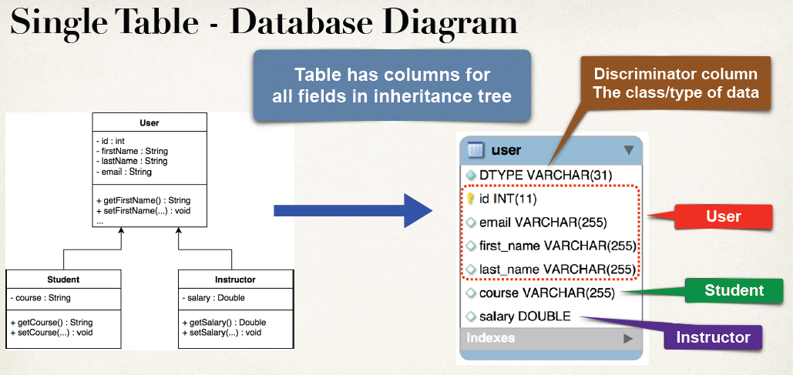
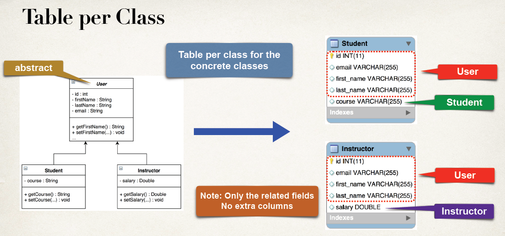
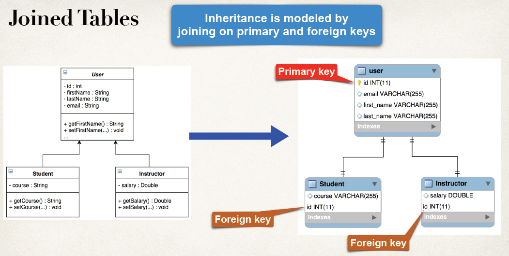
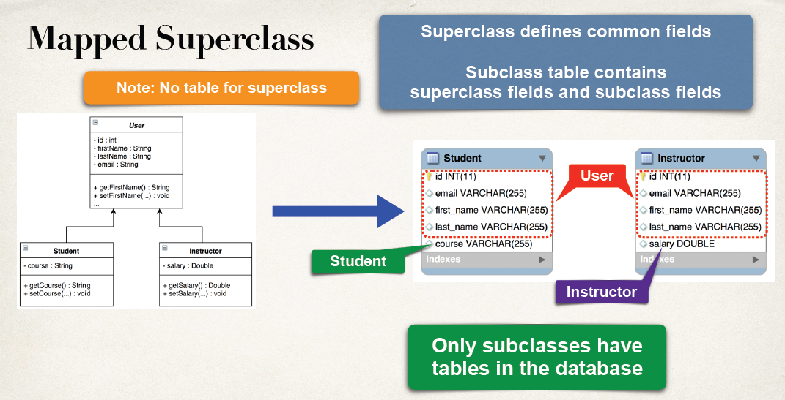
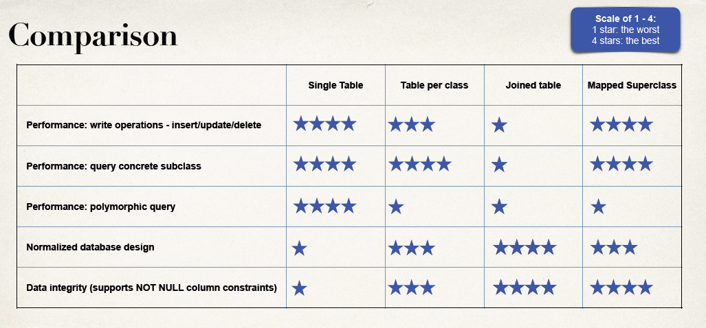

# Hibernate Advanced Development Techniques

#### Annotations to Map Collections

* `@ElementCollection` : Declares an element collection mapping. The data for the collection is stored in a separate table.
    * `@javax.persistence.ElementCollection`
* `@CollectionTable` : Specifies the name of table that will hold the collection. Also provides the join column to refer to primary table.
    * `@javax.persistence.CollectionTable`
* `@Column` : The name of the column to map in the collection table.
    * `@javax.persistence.Column`

`@ElementCollection` is similar to `@OneToMany` except target object is not an `@Entity`

`@ElementCollection` does not support a cascade option. You can't query, persist or merge target objects independently of their parent object


##### 1. Mapping Sets
**Example**

```
	...
	@ElementCollection
	@CollectionTable(name = "image", joinColumns = @JoinColumn(name = "student_id"))
	@Column(name = "file_name")
	private Set<String> images = new HashSet<>();
	...
```


##### 2. Mapping Lists

`@OrderColumn` : The name of the column to track element order / position. Name defaults to `<property>_ORDER`.
* `@javax.persistence.OrderColumn`
* If property name is `images`, then column name will be `images_ORDER`.
* We can override default name as follows `@OrderColumn(name="my_custom_name")`

**Example**

```
	...
	@ElementCollection
	@CollectionTable(name = "image", joinColumns = @JoinColumn(name = "student_id"))
	@OrderColumn
	@Column(name = "file_name")
	private List<String> images = new ArrayList<>();
	...
```


##### 3. Mapping - Maps

`@MapKeyColumn` : The name of the key column for a map. Name defaults to `<property>_KEY`.
* `@javax.persistence.MapKeyColumn`
* If property name is `images`, then column name will be `images_KEY`.
* We can override default name as follows `@MapKeyColumn(name = "my_custom_name")`

**Example**

```
	...
	@ElementCollection
	@CollectionTable(name = "image", joinColumns = @JoinColumn(name = "student_id"))
	@MapKeyColumn(name = "image_name", length = 50)  //(map key) default <property>_KEY
	@Column(name = "image_description") // (map value) default to <property>
	private Map<String, String> images = new HashMap<>();
	...
```


##### 4. Mapping - Sorted Sets


`@OrderBy` : Specifies the ordering of the elements when a collection is retrieved.
* `@javax.persistence.OrderBy`

Syntax: `@OrderBy("[field name or property name] [ASC |DESC]")`

If ASC or DESC is not specified, then ASC is the default

**Example**

```
...
	@ElementCollection
	@CollectionTable(name = "image")
	// @OrderBy // only one possible order; file_name ASC
	@OrderBy("file_name DESC")
	@Column(name = "file_name") // defaults to images
	private Set<String> images = new LinkedHashSet<>();
...
```


##### 5. Mapping - Sorted Maps

`@OrderBy` : Specifies the ordering of the elements when a collection is retrieved.
* `@javax.persistence.OrderBy`

Syntax: `@OrderBy("[field name or property name] [ASC |DESC]")`

If ASC or DESC is not specified, then ASC is the default

**Example**

`@OrderBy("file_name DESC")`

`@OrderBy`
* Defaults to order by map key column, ASC

```
...
	@ElementCollection
	@CollectionTable(name = "image")
	@MapKeyColumn(name = "image_name", length = 50)  //(map key) default <property>_KEY
	@OrderBy // defaults to order by map key column in ascending
	@Column(name = "image_description") // (map value) default to <property>
	private SortedMap<String, String> images = new TreeMap<>();
...
```

We can also use `@org.hibernate.annotations.SortComparator` for custom sorting in place of `@OrderBy`

**Example**

```
	...
	// custom sorting
	public static class DescendingComparator implements Comparator<String>{
		@Override
		public int compare(String o1, String o2) {
			return o2.compareTo(o1);
		}
	}
	...
	@ElementCollection
	@CollectionTable(name = "image")
	@MapKeyColumn(name = "image_name", length = 50)  //(map key) default <property>_KEY
	@SortComparator(DescendingComparator.class) // custom sorting
	@Column(name = "image_description") // (map value) default to <property>
	private SortedMap<String, String> images = new TreeMap<>();
	...
```

---

#### Mapping - Embedded

##### Annotation for Embedded

* `@Embeddable` : Used to annotate a given class as an Embedded value type.
    * `@javax.persistence.Embeddable`
* `@Embedded` : Used to reference an Embedded value type. The use of `@Embedded` is optional
    * `@javax.persistence.Embedded`

**Example**

```
...
@Embeddable
public class Address {
	...
	...
}
```
```
...
@Entity
@Table(name = "student")
public class Student {
	...
	@Embedded // optional since Address class is annotated with @Embeddable
	private Address homeAddress;
	...
}

```

##### Embedded - Reuse Example

We can reuse Embedded type like we can have Address as homeAddress and billingAddress. And attributes can be overridden by using  annotations `@javax.persistence.AttributeOverrides` and `@javax.persistence.AttributeOverride`


```
...
@Embeddable
public class Address {
	...
	@Column(name = "street")
	private String street;

	@Column(name = "city")
	private String city;

	@Column(name = "zipcode")
	private String zipcode;
	...
}
```
```
...
@Entity
@Table(name = "student")
public class Student {
	...
	@Embedded // optional since Address class is annotated with @Embeddable
	private Address homeAddress;
	...
	@AttributeOverrides({
		@AttributeOverride(name = "street", column = @Column(name = "BILLING_STREET")),
		@AttributeOverride(name = "city", column = @Column(name = "BILLING_CITY")),
		@AttributeOverride(name = "zipcode", column = @Column(name = "BILLING_ZIPCODE"))
	})
	private Address billingAddress;
	...
}

```

---

#### Mapping - Enums

##### Annotation for Enums

`@Enumerated` : Used to reference an Enum type
* `@javax.persistence.Enumerated`

**Example**

```
...
public enum Status {
	ACTIVE, INACTIVE
}
```
```
...
@Entity
@Table(name = "student")
public class Student {
	...
	@Enumerated(EnumType.STRING)
	@Column(name = "status")
	private Status status;
	...
}
```

---

#### Mapping Inheritance

##### Inheritance Mapping Strategies
1. Single table
2. Table per class
3. Joined table
4. Mapped superclass

##### Annotation for Inheritance

* `@Inheritance` : Specify the inheritance strategy.
    * `@javax.persistence.Inheritance`
    * Possible values: `SINGLE_TABLE`, `TABLE_PER_CLASS`, `JOINED`
    * Defaults to `SINGLE_TABLE`
* `@DiscriminatorColumn` : Name of the column that holds the discriminator values.
    * `@javax.persistence.DiscriminatorColumn`
    * Defaults to `DTYPE`.
    * Can be overridden using `@DiscriminatorColumn(name = "my_custom_name")`
    * `@DiscriminatorColumn` is only required for inheritance `SINGLE_TABLE` strategy
* `@DiscriminatorValue` : A unique value that describes a given subclass. The value is stored in the discriminator column.
    * `@javax.persistence.DiscriminatorValue`
    * Defaults to class name
    * Can be overridden using `@DiscriminatorValue(value="my_custom_name")`
    * `@DiscriminatorValue` is only required for inheritance `SINGLE_TABLE` strategy

##### 1. Single table
* Maps all entities in inheritance tree to a single database table
* A discriminator column indicates the type/class of data in the row
* Table has columns for all fields in the inheritance tree
* Each row will only use a subset of the fields
* Unused fields are null





**Example**

```
...
@Entity
@Table(name = "user")
@Inheritance(strategy = InheritanceType.SINGLE_TABLE)
// @Inheritance is OPTIONAL. default is SINGLE_TABLE
@DiscriminatorColumn(name = "USER_TYPE", length = 255)
@DiscriminatorValue(value = "com.luv2code.hibernate.entity.User")
// @DiscriminatorColumn & @DiscriminatorValue is OPTIONAL
// @DiscriminatorColumn -> Default column name will be DTYPE
// @DiscriminatorValue -> Default value will be class name i.e 'User' in this case
public class User {
	...
	@Id
	@GeneratedValue(strategy = GenerationType.IDENTITY)
	private int id;
	...
}
```
```
...
@Entity
@DiscriminatorValue(value = "com.luv2code.hibernate.entity.Student")
//@DiscriminatorValue is OPTIONAL
//Default value will be class name i.e 'Student' in this case
public class Student extends User {
	...
}
```
```
...
@Entity
@DiscriminatorValue(value = "com.luv2code.hibernate.entity.Instructor")
//@DiscriminatorValue is OPTIONAL
//Default value will be class name i.e 'Instructor' in this case
public class Instructor extends User {
	...
}
```

##### 2. Table per class

* For the inheritance tree, all concrete classes are mapped a table per class
    * Remember, a concrete class is a non-abstract class
* Includes fields defined in subclass and fields inherited from superclass
* These fields are mapped to a table for the concrete class
* Discriminator are not required.





###### ID generation strategy
* When using inheritance strategy `TABLE_PER_CLASS`, it is required to use ID generation strategy `TABLE` i.e. `@GeneratedValue(strategy = GenerationType.TABLE)`.
* Each table has an ID field
* Since entities span multiple tables, the next generated ID value can be maintained in a separate table known as a 'sequence table'. Hibernate will create a sequence table automatically.
* This sequence table will hold the 'next_val' to use as a base for next id.
* Behind the scenes, Hibernate will get the next value from the sequence table and then increment it by 1 (thread-safe)
* Modifications in Hibernate Config file
    * Increase pool size in since additional connections are needed for accessing sequence table
    * Upgrade to MySQL 8 dialect. Needed for creation of sequence table

**Example**

```
...
@Entity
@Table(name = "user")
@Inheritance(strategy = InheritanceType.TABLE_PER_CLASS)
// @DiscriminatorColumn & @DiscriminatorValue is not required when using TABLE_PER_CLASS strategy
public class User {
	...
	@Id
	@GeneratedValue(strategy = GenerationType.TABLE)
	// when using Inheritance strategy as TABLE_PER_CLASS
	// GeneratedValue strategy for Id should be GenerationType.TABLE
	private int id;
	...
}
```
```
...
@Entity
// @DiscriminatorValue is not required when using TABLE_PER_CLASS strategy
public class Student extends User {
	...
}

```
```
...
@Entity
// @DiscriminatorValue is not required when using TABLE_PER_CLASS strategy
public class Instructor extends User {
	...
}
```

##### 3. Joined table

* For the inheritance tree, all classes are mapped to a table
* Superclass table contains fields common to all subclasses
* Subclass tables contain only fields specific to the subclass
* Inheritance is modeled with a foreign key
* Hibernate will join the data based on primary key and foreign key





**Example**

```
...
@Entity
@Table(name = "user")
@Inheritance(strategy = InheritanceType.JOINED)
// @DiscriminatorColumn & @DiscriminatorValue is not required when using JOINED strategy
public class User {
	...
	@Id
	@GeneratedValue(strategy = GenerationType.IDENTITY)
	private int id;
	...
}
```
```
...
@Entity
// @DiscriminatorValue is not required when using JOINED strategy
public class Student extends User {
	...
}
```
```
...
@Entity
// @DiscriminatorValue is not required when using JOINED strategy
public class Instructor extends User {
	...
}
```

##### 4. Mapped Superclass

`@MappedSuperclass` : Designates a class whose mapping is applied to entities that inherit from it.
* A mapped superclass has no separate table defined for it.
* `@javax.persistence.MappedSuperclass`


* For the inheritance tree, subclass is mapped to a table
* Each table has the inherited fields and fields defined in the subclass
* The mapped superclass is no longer a separate table/entity (no `@Entity`)
* Only the subclasses will use `@Entity`
* Only the subclasses will have tables in the database
* Similar to Table per Class strategy but
    * No table for superclass
    * No table joins or inheritance exists in the database schema
    * Inheritance only exists in the Java object model
* In superclass, remove the annotations: `@Entity`, `@Table`, `@Inheritance`
* In superclass, annotate superclass with `@MappedSuperclass`
* In subclasses, use normal Hibernate annotation: `@Entity`. (can also customize with `@Table`, `@Column` etc.)





**Example**

```
...
@MappedSuperclass
public class User {
	...
	@Id
	@GeneratedValue(strategy = GenerationType.IDENTITY)
	private int id;
	...
}
```
```
...
@Entity
public class Student extends User {
	...
}
```
```
...
@Entity
public class Instructor extends User {
	...
}
```

---

#### Comparison - Inheritance Strategy

* Best performance with queries and write operations
    * **Single table**
* Good performance for queries of subclasses and data integrity
    * **Table per class or Mapped Superclass**
* Normalized database design and data integrity
    * **Joined table**





---

